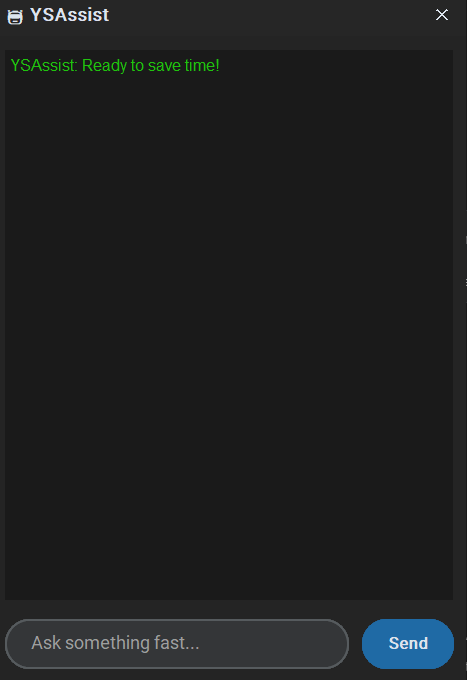

# ysassist
An Agentic Desktop Assistant powered by Gemini API and Python
# YSAssist: Agentic Desktop Assistant 🤖

YSAssist is a Python-based assistant that bridges natural language with local system execution using the Gemini API.

## 📸 GUI Snapshot
 
*(Replace gui_screenshot.png with your actual file name in the assets folder)*

## 🚀 Key Features
- **Agentic Execution:** Opens apps and manages files autonomously.
- **System Monitoring:** Real-time CPU/RAM/Battery tracking.
- **Gemini Brain:** Intelligent conversational AI.

## 🛠️ Tech Stack
- **Language:** Python 3.10+
- **AI:** Google Gemini API (Flash 1.5)
- **UI:** CustomTkinter
